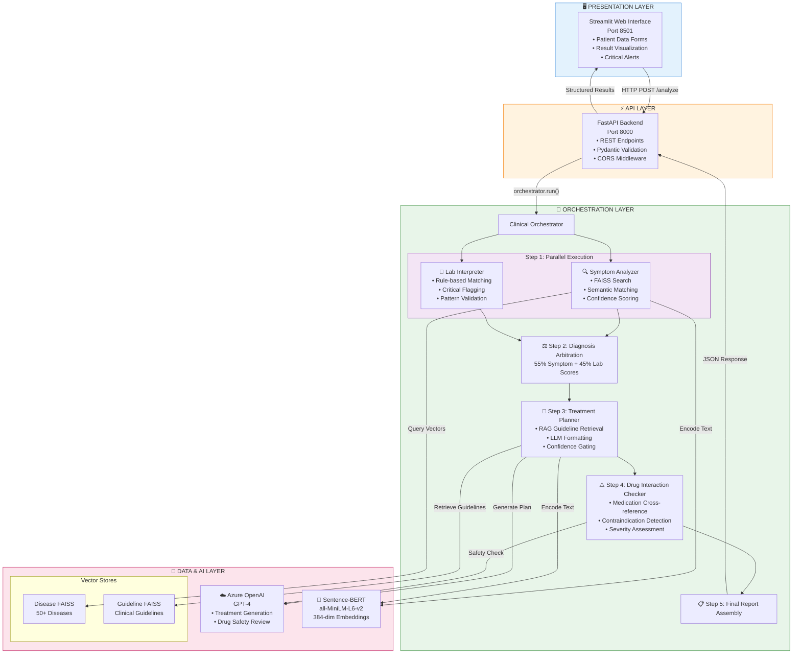
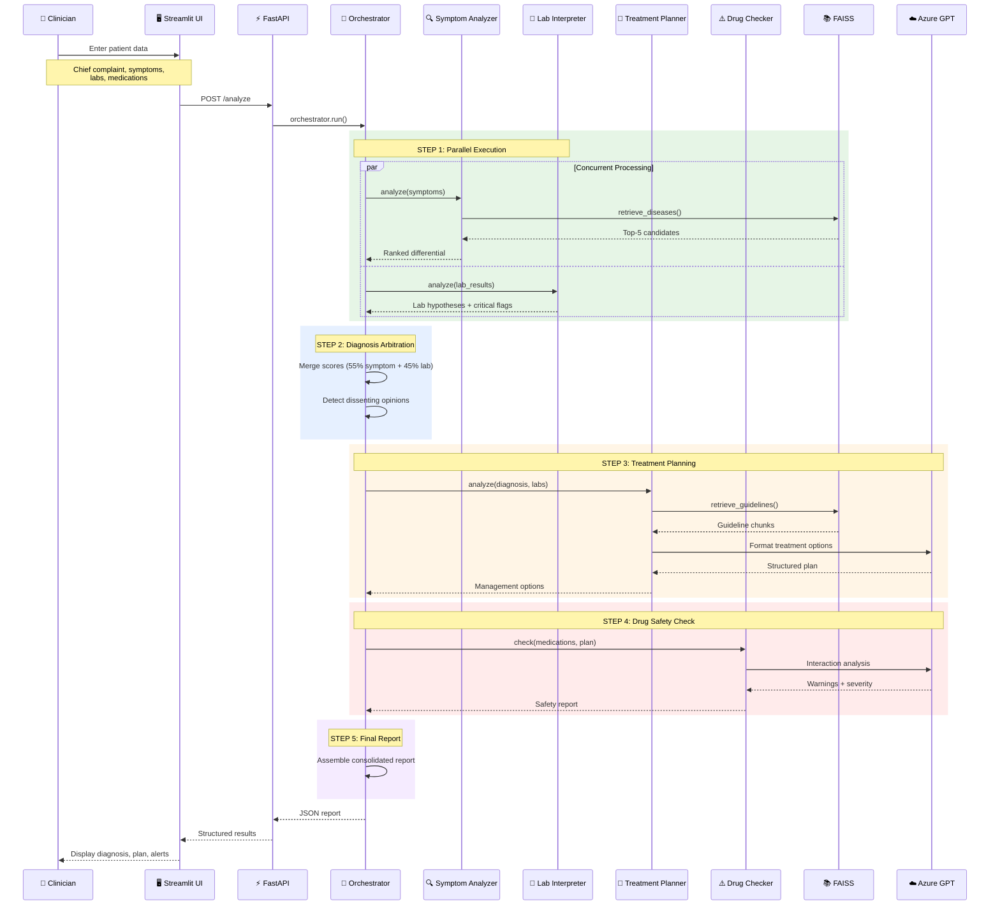

# MedOrchestrator Architecture Diagrams

Use these diagrams for your presentation. You can:
1. Render them at https://mermaid.live/ and export as PNG/SVG
2. Copy the ASCII diagrams directly into PowerPoint
3. Use the mermaid code in GitHub README (already supported)

---

## DIAGRAM 1: System Architecture (Flowchart)

### Mermaid Code (paste at mermaid.live):



---

## DIAGRAM 2: Clinical Workflow (Sequence Diagram)

### Mermaid Code (paste at mermaid.live):



---

## DIAGRAM 3: Simple ASCII Architecture (Copy to PPT directly)

```
┌─────────────────────────────────────────────────────────────────────────────┐
│                        🖥️ PRESENTATION LAYER                               │
│  ┌───────────────────────────────────────────────────────────────────────┐  │
│  │              STREAMLIT WEB INTERFACE (Port 8501)                      │  │
│  │   • Patient Data Forms    • Result Visualization   • Critical Alerts  │  │
│  └───────────────────────────────────┬───────────────────────────────────┘  │
└──────────────────────────────────────┼──────────────────────────────────────┘
                                       │ HTTP POST /analyze
┌──────────────────────────────────────▼──────────────────────────────────────┐
│                           ⚡ API LAYER                                      │
│  ┌───────────────────────────────────────────────────────────────────────┐  │
│  │               FASTAPI BACKEND (Port 8000)                             │  │
│  │   • REST Endpoints   • Pydantic Validation   • CORS Middleware        │  │
│  └───────────────────────────────────┬───────────────────────────────────┘  │
└──────────────────────────────────────┼──────────────────────────────────────┘
                                       │ orchestrator.run()
┌──────────────────────────────────────▼──────────────────────────────────────┐
│                      🎯 ORCHESTRATION LAYER                                 │
│                                                                             │
│   ┌─────────────────────────────────────────────────────────────────────┐   │
│   │                    CLINICAL ORCHESTRATOR                            │   │
│   │                                                                     │   │
│   │   STEP 1: PARALLEL EXECUTION (ThreadPoolExecutor)                   │   │
│   │   ┌──────────────────────┐    ┌──────────────────────┐              │   │
│   │   │ 🔍 SYMPTOM ANALYZER  │    │ 🧪 LAB INTERPRETER   │              │   │
│   │   │ • FAISS Search       │    │ • Rule-based Match   │              │   │
│   │   │ • Semantic Matching  │    │ • Critical Flagging  │              │   │
│   │   │ • Confidence Score   │    │ • Pattern Validation │              │   │
│   │   └──────────┬───────────┘    └───────────┬──────────┘              │   │
│   │              └────────────┬───────────────┘                         │   │
│   │                           ▼                                         │   │
│   │   STEP 2: ⚖️ DIAGNOSIS ARBITRATION                                  │   │
│   │           55% Symptom Score + 45% Lab Score → Ranked Candidates     │   │
│   │           Detect Dissenting Opinions (Agent Disagreements)          │   │
│   │                           │                                         │   │
│   │                           ▼                                         │   │
│   │   STEP 3: 💊 TREATMENT PLANNER                                      │   │
│   │           • RAG: Retrieve Clinical Guidelines from FAISS            │   │
│   │           • LLM: Format into Structured Management Options          │   │
│   │           • Confidence Gating (threshold = 0.4)                     │   │
│   │                           │                                         │   │
│   │                           ▼                                         │   │
│   │   STEP 4: ⚠️ DRUG INTERACTION CHECKER                               │   │
│   │           • Cross-reference Current Medications                     │   │
│   │           • LLM: Identify Contraindications                         │   │
│   │           • Assess Severity (Low / Medium / High)                   │   │
│   │                           │                                         │   │
│   │                           ▼                                         │   │
│   │   STEP 5: 📋 FINAL REPORT ASSEMBLY                                  │   │
│   │           • Diagnosis + Confidence + Uncertainty                    │   │
│   │           • Treatment Options + Monitoring + Follow-up              │   │
│   │           • Drug Warnings + Critical Flags + Dissenting Opinions    │   │
│   └─────────────────────────────────────────────────────────────────────┘   │
└──────────────────────────────────────┬──────────────────────────────────────┘
                                       │
┌──────────────────────────────────────▼──────────────────────────────────────┐
│                         💾 DATA & AI LAYER                                  │
│                                                                             │
│   ┌──────────────────┐  ┌──────────────────┐  ┌────────────────────────┐   │
│   │ 📚 DISEASE FAISS │  │ 📚 GUIDELINE     │  │ ☁️ AZURE OPENAI (GPT-4)│   │
│   │    Vector Store  │  │    FAISS Store   │  │                        │   │
│   │                  │  │                  │  │ • Treatment Generation │   │
│   │ • 50+ Diseases   │  │ • 5+ Clinical    │  │ • Drug Safety Review   │   │
│   │ • Symptom Embed  │  │   Guidelines     │  │ • Low Temperature (0.2)│   │
│   └──────────────────┘  └──────────────────┘  └────────────────────────┘   │
│                                                                             │
│   ┌─────────────────────────────────────────────────────────────────────┐   │
│   │            🧠 SENTENCE-BERT EMBEDDER (all-MiniLM-L6-v2)             │   │
│   │                    Text → 384-dimensional Vectors                   │   │
│   └─────────────────────────────────────────────────────────────────────┘   │
└─────────────────────────────────────────────────────────────────────────────┘
```

---

## DIAGRAM 4: Data Flow (Simple)

```
┌──────────────────────────────────────────────────────────────────────────┐
│                           PATIENT INPUT                                  │
│  Chief Complaint: "High fever with body ache"                           │
│  Symptoms: ["fever", "body pain", "headache", "chills"]                 │
│  Lab Results: {"platelets": 80000, "hematocrit": 52}                    │
│  Current Medications: ["Ibuprofen"]                                     │
└────────────────────────────────┬─────────────────────────────────────────┘
                                 │
                                 ▼
┌────────────────────────────────────────────────────────────────────────────┐
│  STEP 1: PARALLEL ANALYSIS                                                │
│  ┌────────────────────────────┐    ┌─────────────────────────────────┐    │
│  │ Symptom Analyzer           │    │ Lab Interpreter                 │    │
│  │ ─────────────────────────  │    │ ───────────────────────────────│    │
│  │ Dengue:  0.66 (high)       │    │ Dengue:  0.50 (partial)        │    │
│  │ Malaria: 0.67 (high)       │    │ Critical: LOW PLATELETS 🚨     │    │
│  │ Typhoid: 0.51 (medium)     │    │ Signal: elevated hematocrit    │    │
│  └────────────────────────────┘    └─────────────────────────────────┘    │
└────────────────────────────────┬──────────────────────────────────────────┘
                                 │
                                 ▼
┌────────────────────────────────────────────────────────────────────────────┐
│  STEP 2: DIAGNOSIS ARBITRATION                                            │
│  ────────────────────────────────────────────────────────────────────────│
│  Formula: 0.55 × symptom_score + 0.45 × lab_score                        │
│                                                                          │
│  1. Dengue       → 0.588 = (0.66 × 0.55) + (0.50 × 0.45) ← PRIMARY      │
│  2. Malaria      → 0.369 = (0.67 × 0.55) + (0.00 × 0.45)                 │
│  3. Dengue Fever → 0.456 = (0.42 × 0.55) + (0.50 × 0.45)                 │
│                                                                          │
│  🔀 DISSENT: Malaria is #1 in symptoms but #4 in labs                    │
└────────────────────────────────┬──────────────────────────────────────────┘
                                 │
                                 ▼
┌────────────────────────────────────────────────────────────────────────────┐
│  STEP 3: TREATMENT PLANNING                                               │
│  ────────────────────────────────────────────────────────────────────────│
│  RAG Query: "Dengue treatment management guidelines"                     │
│  Retrieved: dengue_guidelines_chunk_1, dengue_guidelines_chunk_2 ...     │
│                                                                          │
│  LLM Output:                                                             │
│  • Option: "Clinician may consider supportive care, hydration..."        │
│  • Monitoring: "Regular platelet and hematocrit monitoring"              │
│  • Follow-up: "Reassess clinically in 24-48 hours"                       │
└────────────────────────────────┬──────────────────────────────────────────┘
                                 │
                                 ▼
┌────────────────────────────────────────────────────────────────────────────┐
│  STEP 4: DRUG SAFETY CHECK                                                │
│  ────────────────────────────────────────────────────────────────────────│
│  Current Meds: ["Ibuprofen"]                                             │
│  Diagnosis: Dengue                                                       │
│                                                                          │
│  ⚠️ WARNING: Ibuprofen may increase bleeding risk in dengue             │
│     (thrombocytopenia + NSAID antiplatelet effect)                       │
│                                                                          │
│  Severity: HIGH    Review Required: YES                                  │
└────────────────────────────────┬──────────────────────────────────────────┘
                                 │
                                 ▼
┌────────────────────────────────────────────────────────────────────────────┐
│  STEP 5: FINAL REPORT                                                     │
│  ────────────────────────────────────────────────────────────────────────│
│  ┌────────────────────────────────────────────────────────────────────┐  │
│  │  🩺 Primary Diagnosis: DENGUE                                      │  │
│  │  📊 Confidence: 58.8%                                              │  │
│  │  ⚠️ Uncertainty: TRUE (confidence < 60%)                          │  │
│  │                                                                    │  │
│  │  🚨 Critical Flags: LOW PLATELETS                                  │  │
│  │  💊 Drug Warning: Ibuprofen bleeding risk (HIGH SEVERITY)          │  │
│  │                                                                    │  │
│  │  🔀 Dissenting Opinion:                                            │  │
│  │     Malaria: Symptom rank #1, Lab rank #4                          │  │
│  │                                                                    │  │
│  │  📋 Treatment: Supportive care, hydration, monitoring              │  │
│  │  👨‍⚕️ Clinician Action Required: YES                                │  │
│  └────────────────────────────────────────────────────────────────────┘  │
└────────────────────────────────────────────────────────────────────────────┘
```

---

## HOW TO USE THESE DIAGRAMS

### Option 1: mermaid.live (Recommended)
1. Go to https://mermaid.live/
2. Paste the mermaid code (```mermaid...```)
3. Click "Export" → PNG or SVG
4. Insert into PowerPoint

### Option 2: GitHub README
- Mermaid is natively supported in GitHub
- Just include the code blocks in your README.md

### Option 3: ASCII Diagrams
- Copy the ASCII art directly into PowerPoint
- Use a monospace font (Consolas, Courier New)
- Font size: 10-12pt

### Option 4: draw.io / diagrams.net
- Manually recreate using the structure above
- More control over colors and styling
