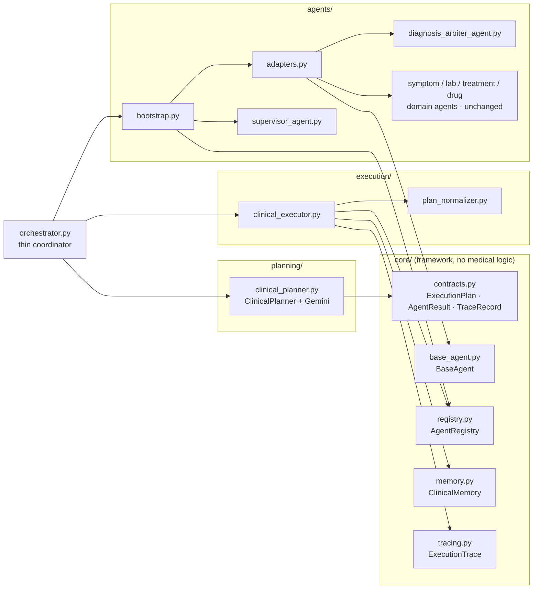
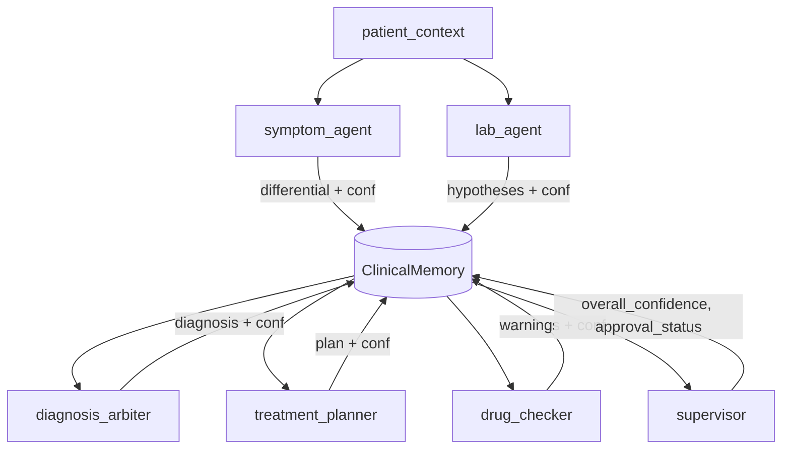
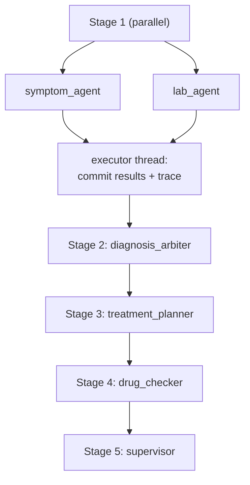

# Planner-Executor Architecture

This document describes the enterprise Planner-Executor multi-agent architecture
introduced on top of the original fixed-pipeline orchestrator, and how to
migrate to / operate it.

---

## 1. Goals & principles

- **Thin orchestrator** — coordination only, no medical reasoning.
- **LLM Planner decides *which* agents run** from available patient data (no
  hardcoded `if/else` selection rules).
- **Executor decides nothing clinical** — it only runs the plan safely.
- **Registry** — the executor resolves agents by name and never imports them, so
  new agents are added without touching executor code.
- **Memory** — one in-memory object carries patient context + accumulating
  outputs + histories; injectable into planner and executor.
- **Supervisor** — governance layer that validates the assembled result.
- **Tracing** — every run/agent produces structured telemetry in the report.
- **Backward compatible** — same API, same response schema, Streamlit unchanged.

**The central design split:** the LLM chooses the *policy* (which agents, from
the data); the declarative dependency graph provides the *mechanism* (safe
ordering and parallelism). An LLM never dictates execution order that could
violate a data dependency (e.g. treating before a diagnosis exists).

---

## 2. Component diagram

---

## 3. Agent communication (data through Memory)

Agents never call each other directly. Each reads its inputs from
`ClinicalMemory` and publishes an `AgentResult` (with a self-confidence and an
`input_assessment` recording the confidence it consumed — confidence chaining).

---

## 4. Thread execution model

Agents within one stage are independent (guaranteed by the normalizer), so they
run in a thread pool. Worker threads only read memory and return; the executor
thread performs all memory writes and trace recording after the stage, so there
are no data races.

---

## 5. Plan → stages (normalizer)

The planner emits `{agents, parallel, reasoning}`. The normalizer performs pure
graph operations to produce safe stages:

1. **Closure over `requires`** — selecting `treatment_planner` pulls in
   `diagnosis_arbiter`; `drug_checker` pulls in `treatment_planner`.
2. **Arbitration bridge** — any intake agent selected ⇒ `diagnosis_arbiter`
   included.
3. **Supervisor last** — always appended as a final stage.
4. **Topological layering** — agents whose in-plan `dependencies` are satisfied
   share a parallel stage.

| Planner selects | Effective stages |
|---|---|
| symptom + lab + treatment + drug | `[symptom, lab]` → `[arbiter]` → `[treatment]` → `[drug]` → `[supervisor]` |
| symptom only | `[symptom]` → `[arbiter]` → `[treatment]?` → `[supervisor]` |
| lab only | `[lab]` → `[arbiter]` → `[supervisor]` |
| drug (closure) | pulls treatment + arbiter, then `[supervisor]` |

---

## 6. Migration notes (from the fixed pipeline)

**What moved**
- Arbitration (`_arbitrate_diagnosis`, `_rank_position`) moved **verbatim** from
  `orchestrator.py` into `agents/diagnosis_arbiter_agent.py`. Weights (0.55 /
  0.45), uncertainty threshold (0.6) and dissenting logic are unchanged, so the
  diagnosis is numerically identical.
- `_safe_parse_json` moved into `agents/adapters.py` (drug-checker parsing).
- The 5-step imperative `run()` body was replaced by planner → executor → report.

**What stayed the same**
- `ClinicalOrchestrator.run(chief_complaint, symptoms, lab_results, current_medications)`
  — identical signature.
- Every existing report key. New keys are strictly additive.
- The four domain agent classes and their method signatures.
- The Gemini client, RAG retriever, FastAPI endpoints and Streamlit UI.

**Behavioural change (intended)**
- Agents are now run **conditionally** based on the LLM plan. Previously both
  intake agents always ran even with no data; now a symptoms-only patient never
  instantiates the lab/drug agents. When both symptoms and labs are present (the
  previously-tested path), behaviour matches the old pipeline.

**Deliberate ordering decision**
- The prose target described drug-check *before* treatment planning, but
  `DrugInteractionCheckerAgent.check()` consumes the treatment planner's
  `management_options`. To honour "no breaking agent interfaces / backward
  compatible", the order remains **treatment → drug**, encoded as a declared
  dependency.

**Rollback**
- The change is additive at the package level (`core/`, `planning/`,
  `execution/`, new `agents/*`). Reverting the `orchestrator.py` commit restores
  the legacy pipeline; the new packages can remain dormant.

---

## 7. Extending: adding a new agent

1. Implement a `BaseAgent` adapter (read from memory, return `AgentResult`).
2. Declare `dependencies` (soft ordering) and `requires` (hard prerequisites).
3. Register it in `agents/bootstrap.py`.
4. Mention it in the planner prompt if the LLM should be able to select it.

No change to the executor, orchestrator, or other agents is required.

---

## 8. Setup, requirements, testing, samples

See [`README.md`](README.md) for the directory tree, setup guide, requirements,
run commands, testing instructions, and sample request/response payloads.
