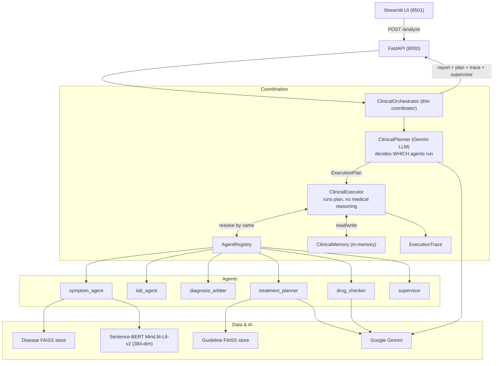
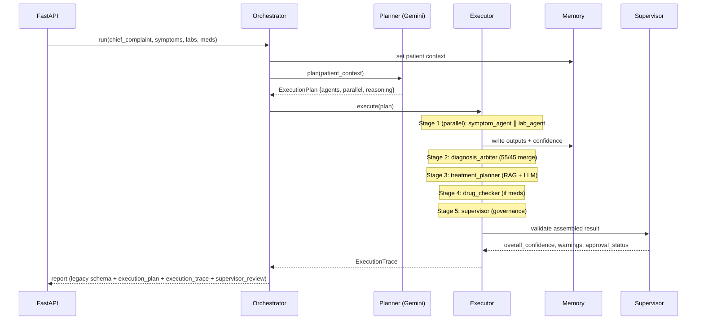
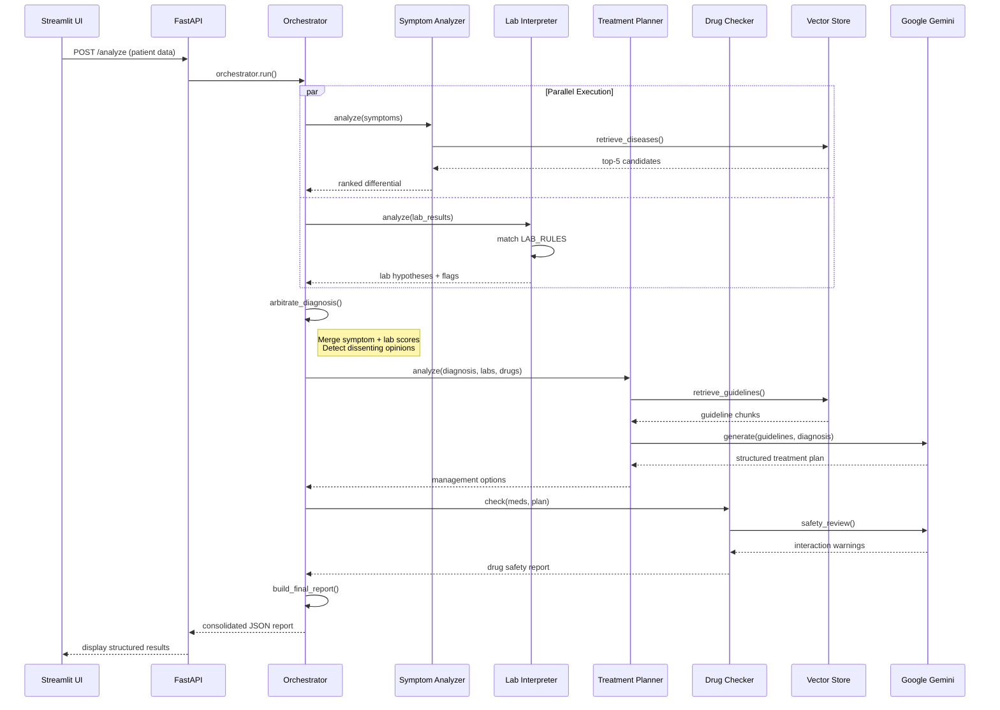

# MedOrchestrator 🏥

**A Multi-Agent Clinical Decision Support System**

MedOrchestrator is an AI-powered clinical decision-support platform that orchestrates multiple specialized agents to analyze patient symptoms, lab results, and medications in parallel — producing differential diagnoses, evidence-based treatment recommendations, and drug-safety alerts under clinician supervision.

> **⚠️ Medical Disclaimer:** This system is a clinical decision-support aid only. It does NOT constitute a prescription or medical order. All treatment decisions must be made by a licensed clinician after independent evaluation.

---

## 🎯 What Does MedOrchestrator Do?

MedOrchestrator takes patient data (chief complaint, symptoms, lab values, current medications) and runs it through a **Planner-Executor multi-agent architecture**. An LLM **Planner** (Gemini) inspects the available data and decides *which* agents to run; a **Executor** runs them over an **Agent Registry**, and a **Supervisor** validates the assembled result:

1. **Planner (LLM)** → decides the agent set from available data (symptoms present → symptom agent; labs present → lab agent; both → run in parallel; medications present → drug checker). No hardcoded routing rules.
2. **Symptom Analysis** → retrieves and ranks differential diagnoses via semantic matching against a disease knowledge base
3. **Lab Interpretation** → validates hypotheses with rule-based lab analysis and flags critical values
4. **Diagnosis Arbitration** → combines symptom and lab evidence into a weighted diagnostic ranking (55% / 45%)
5. **Treatment Planning** → retrieves clinical guidelines and generates guideline-aligned management options
6. **Drug Safety Check** → validates proposed treatments against current medications and flags interactions
7. **Supervisor (governance)** → validates diagnosis consistency, confidence, conflicts and hallucinations; emits an approval verdict

Every agent reports a **confidence score**, every run emits a full **execution trace** (per-agent latency/status/errors), and the result is a structured report — including confidence scores, dissenting opinions, safety warnings, the execution plan, the trace, and the supervisor review — ready for clinician review.

---

## 🏗️ System Architecture

MedOrchestrator uses a **Planner-Executor multi-agent architecture**. The
orchestrator is a thin coordinator: the LLM **Planner** decides *which* agents
run, the **Executor** runs them over an **Agent Registry** (writing to shared
**Memory** and emitting a **Trace**), and the **Supervisor** validates the
result.



### Execution flow (dynamic, plan-driven)

The Planner selects agents from the data; the Executor derives safe parallel
**stages** from the dependency graph (intake agents in parallel → arbitration →
treatment → drug check → supervisor last).



> **Dynamic routing example:** symptoms only → `symptom_agent → diagnosis_arbiter → treatment_planner → supervisor` (lab & drug agents are never instantiated). Labs only → `lab_agent → diagnosis_arbiter → supervisor`. Both + medications → intake agents run in parallel, then treatment, then drug check.

**Design split:** the LLM decides the *policy* (which agents, based on data);
the dependency graph decides the *mechanism* (safe ordering/parallelism). The
Executor contains **no** medical reasoning. See
[`PLANNER_EXECUTOR_ARCHITECTURE.md`](PLANNER_EXECUTOR_ARCHITECTURE.md) for the
full design, migration notes, and additional diagrams.

---

## 🔄 Clinical Workflow

### Input Stage
```
Patient Data
├── Chief Complaint: "High fever with body ache"
├── Symptoms: ["fever", "body pain", "headache", "chills"]
├── Lab Results: {"platelets": 80000, "hematocrit": 52}
└── Current Medications: ["Ibuprofen"]
```

### Processing Pipeline

**Phase 1: Parallel Evidence Gathering (Step 1)**
```
┌─────────────────────────────┐     ┌─────────────────────────────┐
│  Symptom Analyzer           │     │  Lab Interpreter            │
│                             │     │                             │
│  1. Encode symptoms → vector│     │  1. Match labs to thresholds│
│  2. FAISS search (top-5)    │     │  2. Flag critical values    │
│  3. Score by overlap        │     │  3. Match disease patterns  │
│  4. Rank confidence         │     │  4. Score hypothesis support│
│                             │     │                             │
│  Output:                    │     │  Output:                    │
│  • Dengue: 0.66 (high)      │     │  • Dengue: 0.50 (partial)   │
│  • Malaria: 0.67 (high)     │     │  • Critical: low platelets  │
└─────────────────────────────┘     └─────────────────────────────┘
          │                                    │
          └────────────────┬───────────────────┘
                           ▼
```

**Phase 2: Diagnosis Arbitration (Step 2)**
```
Combined Scoring: 0.55 × symptom_score + 0.45 × lab_score

Disease Rankings:
1. Dengue         → 0.588 (0.66 × 0.55 + 0.50 × 0.45) ✓ PRIMARY
2. Malaria        → 0.369 (0.67 × 0.55 + 0.00 × 0.45)
3. Dengue Fever   → 0.456

✓ Dissent Detected: Malaria ranks #1 in symptoms but #4 in labs
                           ▼
```

**Phase 3: Treatment Planning (Step 3)**
```
RAG Retrieval:
• Query: "Dengue treatment management guidelines"
• Top-5 guideline chunks retrieved from FAISS

LLM Generation (Google Gemini):
• System: "Format guidelines as JSON, no prescribing"
• Context: Diagnosis=Dengue, Confidence=0.588, Critical=low platelets
• Output: Conservative management options with monitoring

Confidence Gate: 0.588 > 0.4 ✓ PASS → Generate plan
                           ▼
```

**Phase 4: Drug Safety Check (Step 4)**
```
LLM Safety Review:
• Current: ["Ibuprofen"]
• Proposed: "Supportive care, hydration, platelet monitoring"
• Analysis: ⚠️ Ibuprofen + Dengue → High bleeding risk

Output:
{
  "warnings": ["Ibuprofen may increase bleeding risk"],
  "severity": "high",
  "review_required": true
}
                           ▼
```

**Phase 5: Final Report Assembly (Step 5)**
```json
{
  "diagnosis": {
    "diagnosis": "dengue",
    "confidence": 0.588,
    "uncertainty": true
  },
  "critical_flags": ["low platelets"],
  "treatment_plan": {
    "status": "draft_for_clinician_review",
    "management_options": [...]
  },
  "drug_interaction_check": {
    "warnings": ["Ibuprofen bleeding risk"],
    "severity": "high"
  },
  "dissenting_opinions": [
    {
      "disease": "malaria",
      "symptom_rank": 1,
      "lab_rank": 4,
      "note": "Symptom analysis ranks #1 but lab evidence ranks #4"
    }
  ]
}
```

---

## 🤖 Agent Specifications

| Agent | Role | Approach |
|-------|------|----------|
| **Symptom Analyzer** | Takes chief complaint + symptom list → retrieves relevant conditions from knowledge base → produces ranked differential diagnosis with reasoning | FAISS semantic retrieval + rule-based scoring |
| **Lab Interpreter** | Analyzes lab results in context of the differential → confirms/refutes hypotheses → flags critical values | Rule-based matching via `LAB_RULES` config |
| **Treatment Planner** | Synthesizes outputs from all agents → recommends treatment plan aligned with clinical guidelines → includes dosing, monitoring, and follow-up | RAG (guideline retrieval) + LLM formatting |
| **Drug Interaction Checker** | Reviews current medications + proposed treatments → checks for interactions, allergies, contraindications → flags risks | LLM-based safety review |

---

## ⚙️ Execution Flow — How It All Works



### Key Design Principles

| Principle | Implementation |
|-----------|----------------|
| **Parallel Processing** | ThreadPoolExecutor runs Symptom + Lab agents concurrently (2× faster) |
| **Evidence Fusion** | Weighted arbitration (55% symptoms, 45% labs) prevents single-agent bias |
| **Transparency** | Dissenting opinions exposed when agents disagree by ≥2 ranks |
| **Safety-First** | Confidence gating (0.4 threshold), critical flag escalation, drug interaction validation |
| **Non-Prescriptive** | LLM prompts enforce "may consider" language, no imperative commands |
| **Guideline-Alignment** | RAG retrieval ensures every recommendation has evidence basis |

---

## 🛠️ Tech Stack

| Layer | Technology |
|-------|-----------|
| Frontend | Streamlit |
| Backend API | FastAPI + Uvicorn |
| LLM | Google Gemini (via `google-genai`) |
| Embeddings | Sentence-Transformers (`all-MiniLM-L6-v2`) |
| Vector Store | FAISS |
| Data | JSON disease database + chunked clinical guideline documents |

---

## Project Structure

```
clinical-AI_NW/
├── orchestrator.py                  # Thin coordinator (planner → executor → report)
├── server.py                        # FastAPI backend
├── streamlit_app.py                 # Streamlit frontend
├── requirements.txt
├── .env                             # Gemini credentials (GEMINI_API_KEY, GEMINI_MODEL)
├── test_architecture.py             # Dependency-free architecture tests
├── test_orchestrator.py             # End-to-end tests (needs full env)
│
├── core/                            # Framework abstractions (no medical logic)
│   ├── contracts.py                 # ExecutionPlan, AgentResult, TraceRecord
│   ├── base_agent.py                # BaseAgent interface (dependencies/requires)
│   ├── registry.py                  # AgentRegistry (lazy, name→agent)
│   ├── memory.py                    # ClinicalMemory (in-memory shared context)
│   └── tracing.py                   # ExecutionTrace + execution-id
│
├── planning/
│   └── clinical_planner.py          # ClinicalPlanner (Gemini decides agent set)
│
├── execution/
│   ├── clinical_executor.py         # Runs the plan (no medical reasoning)
│   └── plan_normalizer.py           # Dependency closure + stage layering
│
├── agents/
│   ├── bootstrap.py                 # build_default_registry (agents self-register)
│   ├── adapters.py                  # BaseAgent wrappers over domain agents
│   ├── symptom_analyzer.py          # Symptom → differential diagnosis
│   ├── lab_interpreter_agent.py     # Lab → hypothesis confirmation
│   ├── diagnosis_arbiter_agent.py   # Arbitration (55/45 merge) — moved from orchestrator
│   ├── treatment_planner_agent.py   # Diagnosis → treatment plans
│   ├── drug_interaction_checker_agent.py  # Medication safety
│   └── supervisor_agent.py          # Governance: consistency/confidence/approval
│
├── config/
│   ├── lab_rules.py                 # Rule-based lab thresholds
│   └── prompts.py                   # LLM system prompts (+ planner prompt)
│
├── llm/
│   └── gemini_client.py             # Google Gemini wrapper
│
├── rag/
│   ├── embedder.py                  # Sentence-transformer encoding
│   ├── vector_store.py              # FAISS index management
│   ├── retriever.py                 # Semantic retrieval (diseases + guidelines)
│   ├── guideline_indexer.py         # Guideline chunk ingestion
│   └── ingest.py                    # Data ingestion pipeline
│
├── data/
│   ├── diseases.json                # Disease knowledge base
│   └── guidelines/                  # Clinical guideline text files
│
├── data_cleaning/
│   ├── guideline_preprocessor.py    # Guideline text chunking
│   └── pdf_TO_txt.py               # PDF → text extraction
│
└── models/
    └── all-MiniLM-L6-v2/           # Local embedding model
```

---

## Setup

### 1. Clone the repository

```bash
git clone https://github.com/Om-Shankar-Thakur/clinical-ai-multiagent.git
cd clinical-AI_NW
```

### 2. Create a virtual environment

```bash
python -m venv venv
venv\Scripts\activate        # Windows
# source venv/bin/activate   # macOS / Linux
```

### 3. Install dependencies

```bash
pip install -r requirements.txt
```

### 4. Configure environment variables

Create a `.env` file in the project root:

```env
GEMINI_API_KEY=your-api-key
GEMINI_MODEL=gemini-2.0-flash
```

> The `.env` file is git-ignored, so credentials never leave your machine.
> Configuration is environment-variable only — there are no absolute paths or
> machine-specific settings in the code, so the project is runnable after a
> fresh clone.

### 5. Provide the local embedding model

The Sentence-BERT model (`models/all-MiniLM-L6-v2/`) is git-ignored to keep the
repo light. Download it once (either via `git lfs`/your model source, or):

```bash
python -c "from sentence_transformers import SentenceTransformer as S; S('sentence-transformers/all-MiniLM-L6-v2').save('models/all-MiniLM-L6-v2')"
```

### 6. Build the vector indices (first time only)

```bash
python rag/ingest.py             # builds vector_store.index (diseases)
python rag/guideline_indexer.py  # builds guideline_store.index (guidelines)
```

---

## Running the Application

### Start the FastAPI backend

```bash
uvicorn server:app --reload --port 8000
```

### Start the Streamlit frontend (in a separate terminal)

```bash
streamlit run streamlit_app.py
```

The UI will open at `http://localhost:8501`. The backend API is available at `http://localhost:8000/docs`.

---

## API Reference

### `POST /analyze`

Runs the full clinical pipeline.

**Request body:**
```json
{
  "chief_complaint": "High fever with body ache",
  "symptoms": ["fever", "body pain", "headache", "chills"],
  "lab_results": {"platelets": 80000, "hematocrit": 52},
  "current_medications": ["Ibuprofen"]
}
```

**Response (abridged):** the legacy report schema is fully preserved, with
additive planner-executor observability keys (`execution_plan`,
`execution_trace`, `supervisor_review`, `agent_confidences`):

```json
{
  "patient_input": { "chief_complaint": "High fever with body ache", "symptoms": ["fever", "body pain", "headache", "chills"], "lab_results": {"platelets": 80000, "hematocrit": 52}, "current_medications": ["Ibuprofen"] },
  "diagnosis": { "diagnosis": "dengue", "confidence": 0.766, "uncertainty": false },
  "ranked_candidates": [ { "disease": "dengue", "combined_score": 0.766 } ],
  "lab_signals": ["low platelets", "elevated hematocrit"],
  "critical_flags": ["low platelets"],
  "treatment_plan": { "status": "draft_for_clinician_review", "management_options": [ { "option": "supportive care", "monitoring": "platelet trend", "follow_up": "48h" } ], "uncertainty_notes": [] },
  "drug_interaction_check": { "warnings": ["NSAID caution in suspected dengue"], "severity": "high", "review_required": true },
  "dissenting_opinions": [],
  "clinician_action_required": true,
  "disclaimer": "This output is a clinical decision support aid only ...",

  "execution_plan": { "agents": ["symptom_agent", "lab_agent", "treatment_planner", "drug_checker"], "parallel": ["symptom_agent", "lab_agent"], "reasoning": "symptoms, labs and medications all present", "source": "llm" },
  "execution_trace": { "execution_id": "exec-1a2b3c4d5e6f", "total_latency_ms": 1873.4, "steps": [ { "agent": "symptom_agent", "start_time": "2026-...", "end_time": "2026-...", "latency_ms": 412.1, "status": "success", "error": null, "confidence": 0.82, "reason": "planner-selected" }, { "agent": "diagnosis_arbiter", "status": "success", "confidence": 0.766, "reason": "added by dependency closure" } ] },
  "supervisor_review": { "overall_confidence": 0.673, "warnings": ["Drug-interaction review flagged issues requiring clinician attention."], "recommendation": "May be presented to the clinician with the noted warnings.", "approval_status": "approved_with_warnings", "checks": { "diagnosis_present": true, "treatment_diagnosis_consistent": true } },
  "agent_confidences": { "symptom_agent": 0.82, "lab_agent": 0.7, "diagnosis_arbiter": 0.766, "treatment_planner": 0.7, "drug_checker": 0.4, "supervisor": 0.673 }
}
```

### `GET /health`

Health check endpoint.

---

## 🧪 Testing

**Architecture tests** (no heavy dependencies — stub the FAISS/LLM agents):

```bash
python test_architecture.py      # prints PASS/FAIL, exits non-zero on failure
# or, if pytest is installed:
pytest test_architecture.py
```

These cover the registry, plan normalizer staging for every data scenario, the
LLM planner (valid output, hallucinated-agent filtering, deterministic
fallback), arbitration weighting, supervisor verdicts, executor ordering/tracing,
and the orchestrator's backward-compatible report schema + dynamic agent
skipping.

**End-to-end tests** (need the full environment, indices and `GEMINI_API_KEY`):

```bash
python test_orchestrator.py
```

---

## Supported Lab Parameters

| Parameter | Critical Threshold | Signal |
|-----------|-------------------|--------|
| Platelets | < 100,000 | Low platelets (critical) |
| Hematocrit | > 50 | Elevated hematocrit |
| Sodium | > 145 | High sodium |
| Hemoglobin | < 10 | Low hemoglobin |
| Oxygen | < 92 | Low oxygen saturation (critical) |
| Glucose | > 200 | High blood sugar (critical) |

---

## License

This project is for educational and research purposes only. Not intended for clinical use without proper regulatory review and clinician oversight.
