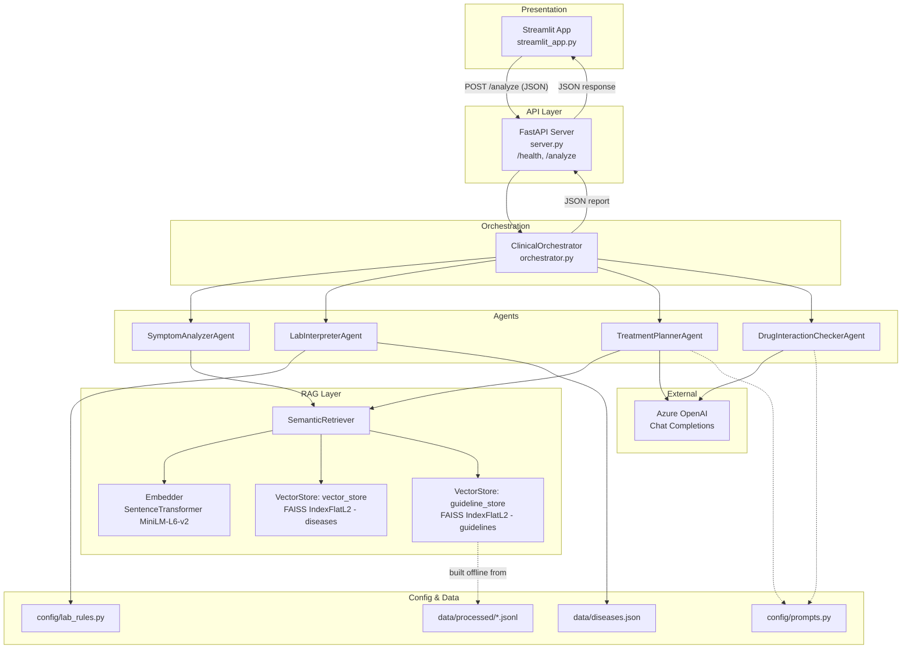
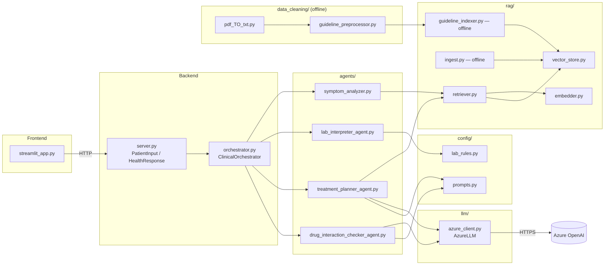
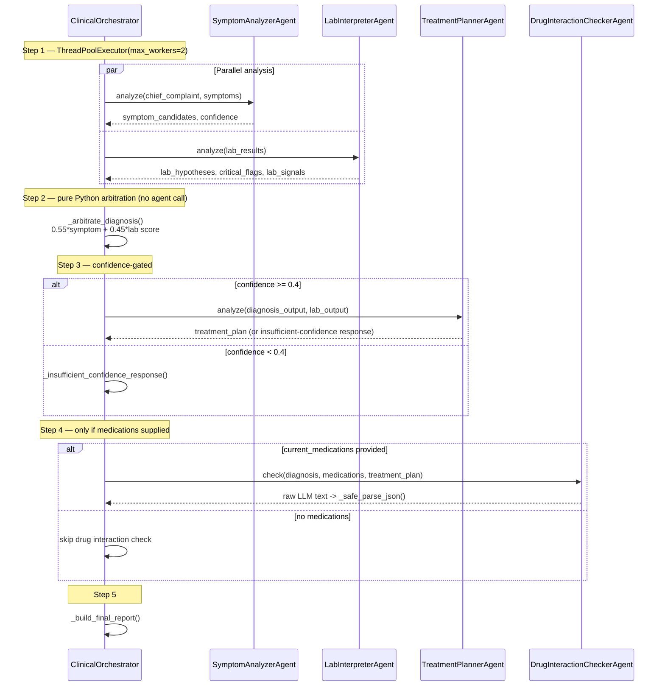
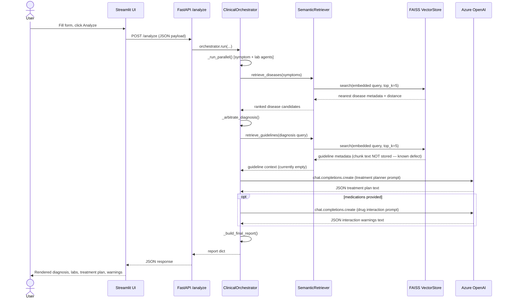
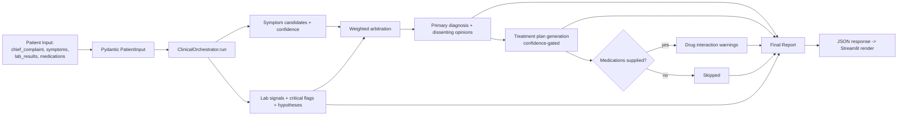
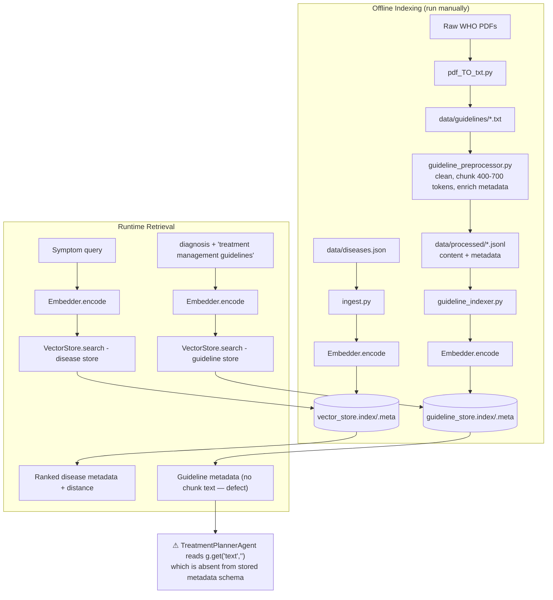
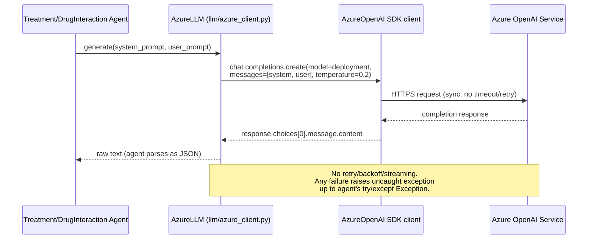
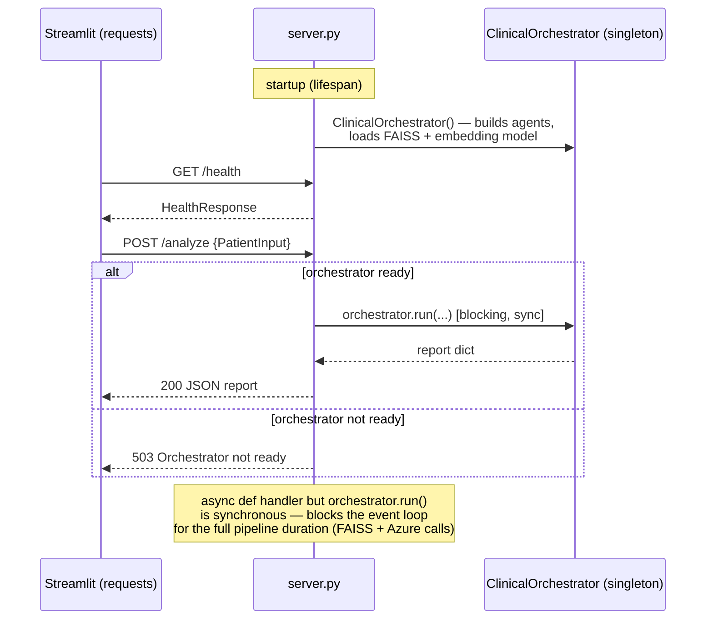
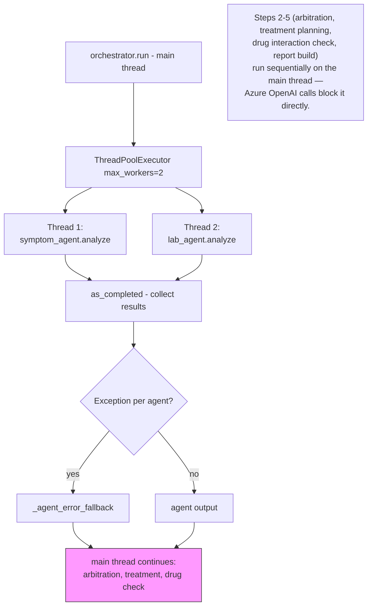
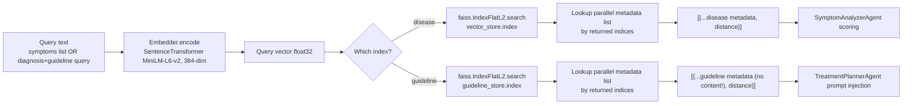

# SYSTEM_ARCHITECTURE.md — clinical-AI_NW

Read-only architecture/diagram document. No source code was modified while producing this document.

## 1. High-Level Architecture

## 2. Component Diagram

## 3. Agent Communication

## 4. Sequence Diagram — Full Request

## 5. Data Flow

## 6. RAG Flow

## 7. LLM Flow

## 8. API Flow

## 9. Thread Execution

## 10. Vector Search Pipeline

## Notes on Diagram Accuracy

These diagrams reflect the codebase as read during this analysis, including the known guideline-RAG content-field defect (see `PROJECT_ANALYSIS.md` §5, §14.1) and the sync-blocking-in-async-handler issue (§14.2). No source files were changed in producing this document.
